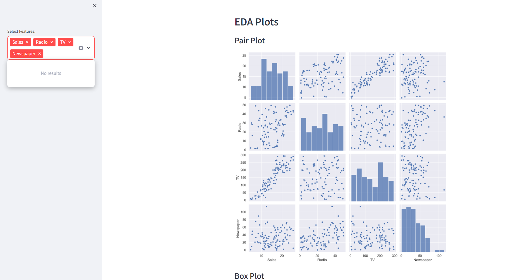

### Ezee Exploratory Data Analysis tool

Quick Start

Clone the repo

$ git clone https://github.com/Ayaz-Ahmad1/Ezee-Exploratory-Data-Analysis-tool.git

$ cd Ezee-Exploratory-Data-Analysis-tool

### Initialize and activate a virtualenv:

$ virtualenv --no-site-packages env
$ source env/bin/activate

### To install the required Python packages, run the following command:

$ pip install -r requirements.txt

### Run the development server:

$ streamlit app.py

### Navigate to URL: http://localhost:8501

Reference image

